# Dossier de conception — Agent Builder
### Plateforme locale de création de workflows d'agents IA

---

**Auteur :** Schleicher Lucas  
**Contexte :** Stage — Capgemini, Practice Cyber Nord-Est  
**Encadrant :** Martini Francky  
**Version :** Première version du dossier de conception  
**Date :** 2026

---

## Résumé

Ce document présente la première version du dossier de conception du projet **Agent Builder**.  
L'objectif du projet est de concevoir une application web locale permettant de composer visuellement des workflows d'agents IA, puis de les sauvegarder et de les exporter sous forme de scripts Python autonomes.

Cette version du dossier se concentre sur :

- le périmètre fonctionnel du MVP ;
- les choix d'architecture ;
- la modélisation UML du système ;
- les principaux cas d'utilisation ;
- les scénarios dynamiques décrits par diagrammes de séquence.

---

## Table des matières

1. [Contexte et objectifs](#1-contexte-et-objectifs)
2. [Architecture générale](#2-architecture-générale)
3. [Choix de conception](#3-choix-de-conception)
4. [Diagramme de classes](#4-diagramme-de-classes)
5. [Diagramme de cas d'utilisation](#5-diagramme-de-cas-dutilisation)
6. [Diagrammes de séquence](#6-diagrammes-de-séquence)
7. [Structure du projet](#7-structure-du-projet)
8. [Conclusion](#8-conclusion)

---

## 1. Contexte et objectifs

### 1.1 Contexte du projet

Le projet **Agent Builder** s'inscrit dans un besoin de création locale de workflows d'agents IA.  
L'objectif est de proposer une solution légère, exécutable en local, permettant de concevoir graphiquement des enchaînements de blocs représentant différents composants d'un workflow IA.

Dans le cahier des charges, l'objectif principal est de développer une **plateforme légère, 100 % locale**, permettant de composer visuellement des workflows d'agents IA et de les **exporter sous forme de script Python autonome**.

### 1.2 Objectifs fonctionnels

Le MVP doit permettre :

- de créer un workflow vide ;
- d'ajouter, déplacer, connecter et supprimer des blocs ;
- de sauvegarder et charger un workflow ;
- d'exécuter un workflow ;
- d'exporter un workflow en fichier Python autonome.

### 1.3 Périmètre du MVP

Le système couvre uniquement les fonctionnalités essentielles du MVP :

- application locale ;
- interface web de type canvas ;
- blocs LLM, Agent, HTTP, Script Python ;
- export Python ;
- exécution locale.

Les éléments suivants ne font **pas** partie du périmètre immédiat :

- authentification ;
- mémoire persistante ;
- multi-utilisateur ;
- déploiement cloud ;
- blocs avancés hors MVP.

---

## 2. Architecture générale

### 2.1 Vision d'ensemble

L'architecture retenue repose sur une séparation claire entre :

- le **domaine** métier ;
- la **logique de création** des blocs ;
- les **services applicatifs** ;
- l'**interface utilisateur**.

Le système s'appuie également sur l'utilisation de design patterns afin de structurer les interactions internes, notamment :

- le pattern **Factory Method** pour la création des blocs ;
- le pattern **Observer** pour la synchronisation entre le modèle et l'interface.

### 2.2 Découpage logique

Le système est organisé en quatre ensembles :

#### Domaine

Le domaine contient les objets métier principaux :

- `Workflow`
- `Block`
- `Port`
- `Connection`

#### Factory Method

La création des blocs repose sur une adaptation académique du pattern *Factory Method*.  
Chaque type de bloc possède un créateur dédié.

#### Services applicatifs

Les services applicatifs portent les opérations globales :

- gestion des workflows ;
- export ;
- exécution.

#### Interface utilisateur

L'interface est découpée en composants spécialisés :

- `Toolbox`
- `Toolbar`
- `Canvas`
- `WorkflowListPanel`
- `BlockUI`

---

## 3. Choix de conception

### 3.1 Choix du pattern Factory Method

Le projet utilise le pattern **Factory Method** pour la création des blocs.  
Ce choix permet :

- de centraliser la logique de création ;
- de séparer la création d'un bloc de son utilisation ;
- de faciliter l'ajout de nouveaux types de blocs ;
- de garder une architecture modulaire et lisible.

Le créateur abstrait `BlockCreator` expose :

- une méthode métier : `add_block_to(workflow)` ;
- une méthode factory protégée : `create_block()`.

Les créateurs concrets sont :

- `LLMBlockCreator`
- `AgentBlockCreator`
- `HTTPBlockCreator`
- `PythonScriptBlockCreator`

### 3.2 Choix du pattern Observer

Le pattern **Observer** est utilisé pour synchroniser automatiquement l'interface utilisateur avec l'état du workflow.

Le `Workflow` joue le rôle de **Publisher** (ou Subject) :

- il maintient une liste de `Subscriber` ;
- il notifie ces derniers à chaque modification de son état (ajout de bloc, suppression, connexion, etc.).

Les composants UI, notamment le `Canvas`, implémentent l'interface `Subscriber` et réagissent aux changements via la méthode `update(workflow)`.

Ce mécanisme permet :

- de découpler le domaine de l'interface utilisateur ;
- d'éviter les appels directs entre couches ;
- de garantir la mise à jour automatique de l'affichage.

### 3.3 Responsabilités des composants UI

#### Toolbox

La `Toolbox` sert à ajouter des blocs au workflow.  
Elle manipule un `BlockCreator` afin de déléguer la création d'un bloc.

#### Toolbar

La `Toolbar` regroupe les actions globales :

- nouveau workflow ;
- sauvegarde ;
- chargement ;
- export ;
- exécution.

#### Canvas

Le `Canvas` représente la zone d'édition principale.  
Il gère l'affichage du workflow et se met à jour automatiquement grâce au pattern Observer.

Le `Canvas` s'abonne au `Workflow` et implémente la méthode `update(workflow)` afin de refléter les changements du modèle.

### 3.4 Persistance

Les objets métier proposent des méthodes de transformation de type :

- `to_dict()` : sérialise l'objet en dictionnaire Python ;
- `from_dict(...)` : reconstruit l'objet à partir d'un dictionnaire.

Le format de sérialisation retenu est **JSON**. Chaque workflow est stocké dans un fichier `.py` (ou `.json` pour la représentation interne) dans le dossier `workflows/` du projet. Ce dossier est scanné au démarrage pour alimenter le `WorkflowListPanel`.

La structure JSON d'un workflow suit le schéma suivant :

```json
{
  "id": "uuid-string",
  "name": "nom_du_workflow",
  "blocks": [
    {
      "id": "uuid-block",
      "type": "LLMBlock",
      "name": "Mon LLM",
      "config": { "api_url": "...", "model_name": "...", "temperature": 0.7 },
      "input_ports": ["..."],
      "output_ports": ["..."]
    }
  ],
  "connections": [
    {
      "id": "uuid-conn",
      "source_block_id": "...",
      "source_port_id": "...",
      "target_block_id": "...",
      "target_port_id": "..."
    }
  ]
}
```

---

## 4. Diagramme de classes

### 4.1 Présentation

Le diagramme de classes constitue la vue structurelle principale de l'application.  
Il met en évidence :

- les entités du domaine ;
- le pattern Factory Method ;
- les services applicatifs ;
- les composants d'interface ;
- le pattern Observer.

<p align="center">
  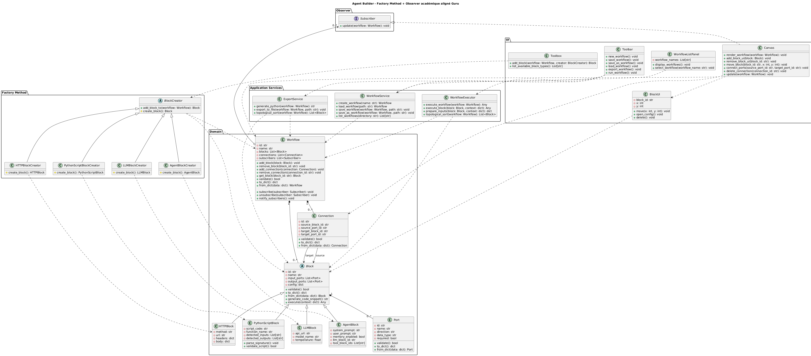<br>
  <em>Figure 1 — Diagramme de classes complet</em>
</p>

<p align="center">
  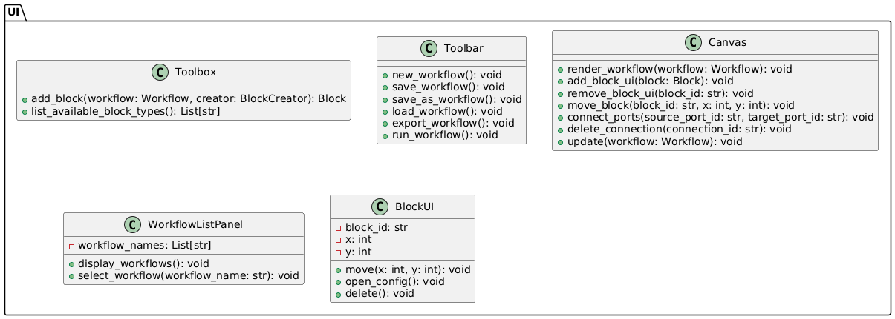<br>
  <em>Figure 2 — Package UI</em>
</p>

<p align="center">
  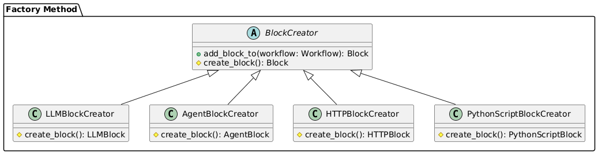<br>
  <em>Figure 3 — Package Factory Method</em>
</p>

<p align="center">
  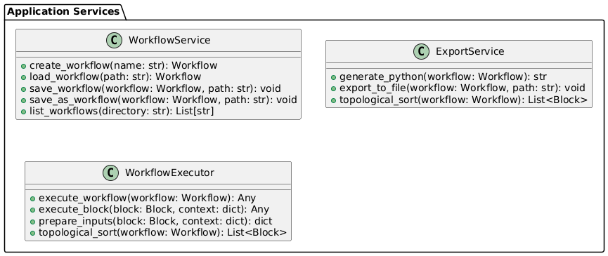<br>
  <em>Figure 4 — Package Application Services</em>
</p>

<p align="center">
  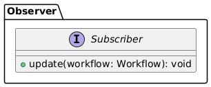<br>
  <em>Figure 5 — Interface Subscriber</em>
</p>

<p align="center">
  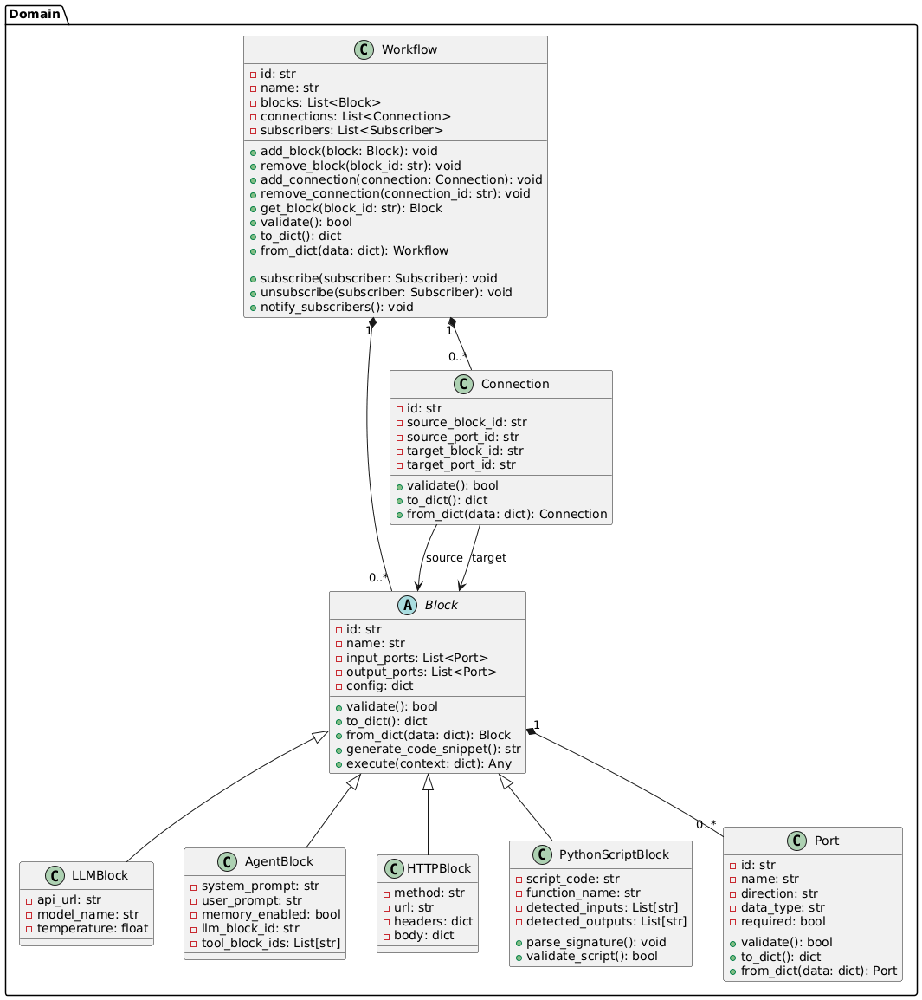<br>
  <em>Figure 6 — Package Domain</em>
</p>

### 4.2 Analyse synthétique

Le modèle repose sur une séparation claire entre le domaine, la création des blocs et les services applicatifs.

Le `Workflow` orchestre les blocs et leurs interactions, tandis que les différentes implémentations de `Block` encapsulent des comportements spécifiques.

L'utilisation du pattern `Factory Method` permet de découpler la création des blocs de leur utilisation et facilite l'extension du système.

Le pattern `Observer` permet de synchroniser automatiquement l'interface utilisateur avec l'état du workflow, en notifiant les composants abonnés tels que le `Canvas`.

Les services applicatifs regroupent les opérations globales (exécution, export, persistance) afin de conserver un domaine métier simple et cohérent.

---

## 5. Diagramme de cas d'utilisation

### 5.1 Présentation

Le diagramme de cas d'utilisation décrit les interactions principales entre l'utilisateur et le système.

<p align="center">
  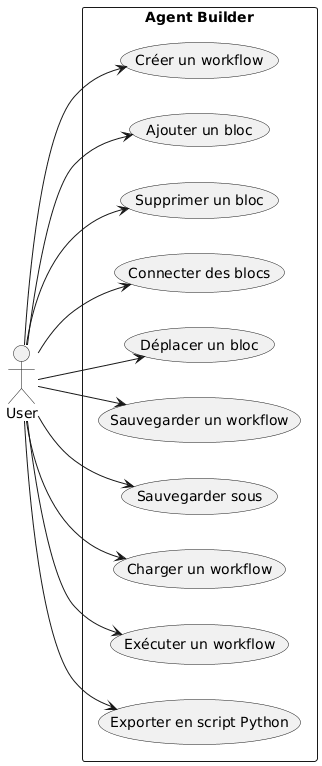<br>
  <em>Figure 7 — Diagramme de cas d'utilisation du MVP</em>
</p>

### 5.2 Analyse

Les cas d'utilisation retenus couvrent les fonctionnalités essentielles du MVP :

- création d'un workflow ;
- édition du workflow ;
- gestion des blocs ;
- sauvegarde et chargement ;
- exécution ;
- export.

---

## 6. Diagrammes de séquence

### 6.1 Objectif

Les diagrammes de séquence présentent le comportement dynamique du système sur les scénarios les plus importants du MVP.

### 6.2 Création d'un bloc

Ce scénario illustre l'utilisation du pattern Factory Method pour l'ajout d'un bloc dans un workflow.

<p align="center">
  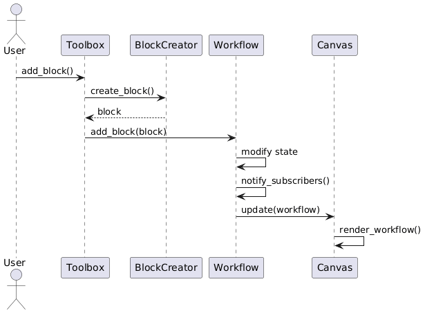<br>
  <em>Figure 8 — Création d'un bloc</em>
</p>

**Analyse**

Le flux est le suivant :

1. l'utilisateur déclenche l'ajout depuis la `Toolbox` ;
2. la `Toolbox` délègue à un `BlockCreator` ;
3. le créateur instancie le bloc ;
4. le bloc est ajouté au `Workflow` ;
5. la référence du bloc est renvoyée ;
6. le `Canvas` ajoute la représentation visuelle correspondante.

### 6.3 Sauvegarde d'un workflow

Ce scénario illustre la sérialisation d'un workflow via `to_dict()` puis son écriture sur le système de fichiers.

<p align="center">
  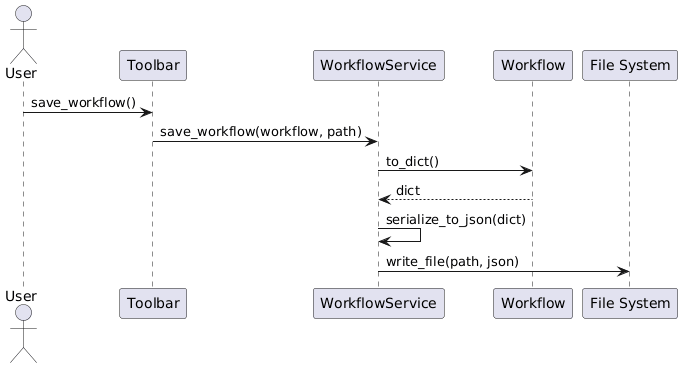<br>
  <em>Figure 9 — Sauvegarde d'un workflow</em>
</p>

**Analyse**

Le `WorkflowService` orchestre l'opération :

- récupération de la structure métier ;
- transformation en dictionnaire Python, puis sérialisation JSON ;
- écriture sur disque dans le dossier `workflows/`.

### 6.4 Chargement d'un workflow

Ce scénario décrit la reconstruction d'un workflow depuis un fichier existant.

<p align="center">
  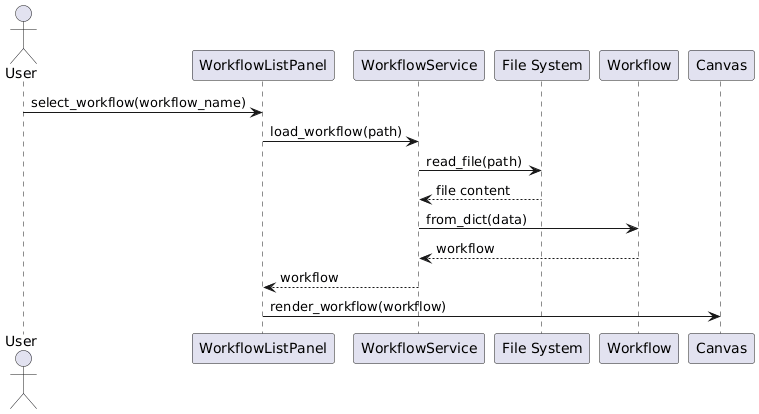<br>
  <em>Figure 10 — Chargement d'un workflow</em>
</p>

**Analyse**

Le scénario de chargement repose sur :

- lecture du fichier JSON depuis `workflows/` ;
- reconstruction du `Workflow` via `from_dict()` ;
- affichage dans le `Canvas`.

### 6.5 Exécution d'un workflow

Ce scénario présente l'enchaînement des blocs au moment de l'exécution.

<p align="center">
  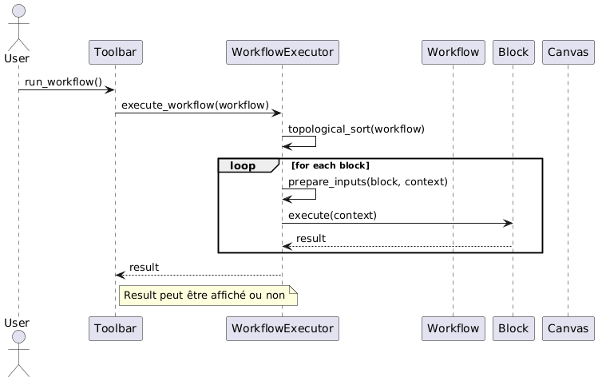<br>
  <em>Figure 11 — Exécution d'un workflow</em>
</p>

**Analyse**

Le `WorkflowExecutor` :

- ordonne les blocs via un tri topologique (algorithme de Kahn) ;
- prépare les entrées de chaque bloc à partir du contexte d'exécution ;
- exécute chaque bloc dans l'ordre ;
- récupère le résultat global.

Le résultat peut être affiché ou non selon le contexte d'exécution.

### 6.6 Export d'un workflow

Ce scénario présente la génération du script Python autonome.

<p align="center">
  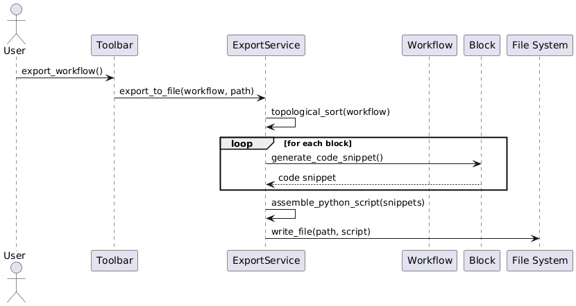<br>
  <em>Figure 12 — Export d'un workflow</em>
</p>

**Analyse**

L'export repose sur :

- l'ordonnancement du workflow ;
- la génération d'un fragment de code par bloc via `generate_code_snippet()` ;
- l'assemblage du script Python final (imports, variables d'env, corps du workflow) ;
- l'écriture du fichier `.py` exporté dans `workflows/`.

---

## 7. Structure du projet

### 7.1 Organisation des fichiers

La structure de répertoires ci-dessous présente l'organisation cible du projet au moment du démarrage du développement. Elle est volontairement simple et lisible pour un développeur Python junior.

```
agent_builder/
├── manage.py                  # Point d'entrée Django
├── .env                       # Clés API et URL (non versionné)
├── .gitignore
├── README.md
├── IDEAS.md
│
├── agent_builder/             # Configuration Django
│   ├── settings.py
│   ├── urls.py
│   └── wsgi.py
│
├── core/                      # Application principale Django
│   ├── domain/                # Couche Domaine
│   │   ├── workflow.py        # Classe Workflow
│   │   ├── block.py           # Classe abstraite Block + sous-classes
│   │   ├── port.py            # Classe Port
│   │   └── connection.py      # Classe Connection
│   │
│   ├── factory/               # Couche Factory Method
│   │   └── block_creators.py  # BlockCreator + créateurs concrets
│   │
│   ├── services/              # Couche Services applicatifs
│   │   ├── workflow_service.py
│   │   ├── export_service.py
│   │   └── workflow_executor.py
│   │
│   ├── api/                   # Vues Django (JSONResponse)
│   │   ├── views.py
│   │   └── urls.py
│   │
│   └── templates/             # HTML / JS du frontend
│       └── index.html
│
├── docs/
│   └── img/                   # Diagrammes UML (PNG)
│       ├── DiagClass.png
│       ├── DomainClass.png
│       ├── UIClass.png
│       ├── FactoryClass.png
│       ├── ServiceClass.png
│       ├── Subscriber.png
│       ├── UseCase.png
│       ├── SeqCreerBlock.png
│       ├── SeqSave.png
│       ├── SeqLoad.png
│       ├── SeqRun.png
│       └── SeqExport.png
│
└── workflows/                 # Workflows sauvegardés (JSON + .py exportés)
    ├── exemple_http.json
    └── exemple_agent.json
```

---

## 8. Conclusion

Cette première version du dossier de conception pose une base solide pour le développement du MVP **Agent Builder**.  
La modélisation proposée permet déjà de :

- structurer le domaine métier ;
- encadrer la création des blocs ;
- formaliser les interactions principales ;
- préparer l'implémentation de l'application.
